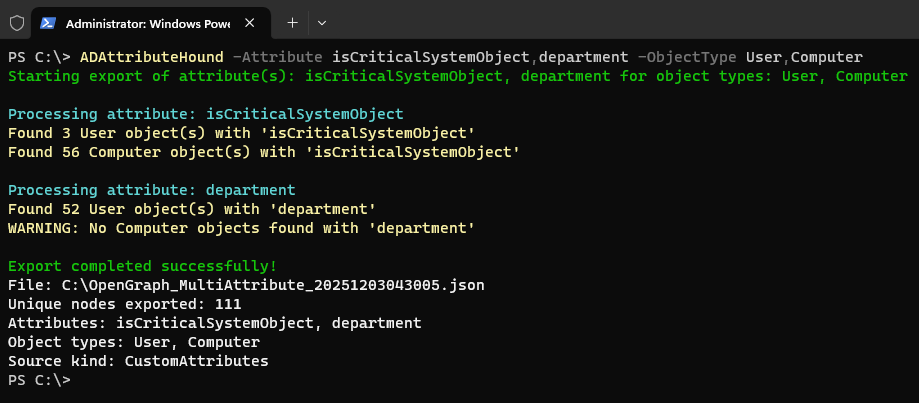

# ADAttributeHound

ADAttributeHound is an [OpenGraph](https://bloodhound.specterops.io/opengraph/overview) extension for [BloodHound](https://bloodhound.specterops.io) that exports Active Directory custom attributes as node properties. BloodHound ingestion will make the properties merge with existing nodes otherwise it creates new nodes.



## Why Custom Attributes Matter

Organizations often store security-relevant metadata in AD custom attributes that BloodHound doesn't collect by default:

| Attribute | Security Relevance |
|-----------|-------------------|
| `extensionAttribute1-15` | Badge IDs, building access, VPN groups, privileged flags |
| `employeeType` | Contractor vs. employee distinctions |
| `department` / `division` | Organizational segmentation for blast radius analysis |

ADAttributeHound makes this hidden context visible in BloodHound, enabling security teams to enrich attack path analysis with organizational metadata.


## Requirements

- PowerShell 5.1+
- Windows with .NET Framework (uses `System.DirectoryServices`)
- Read access to target AD attributes (Authenticated Users typically has read access)
- BloodHound v8.0 or above

## Installation

```powershell
git clone https://github.com/yourorg/ADAttributeHound.git
cd ADAttributeHound
```

No additional dependencies required—uses native .NET libraries.

## Usage

### Basic Usage

```powershell
# Import the function
. .\ADAttributeHound.ps1

# Export a single attribute for all users
ADAttributeHound -Attribute "extensionAttribute1" -ObjectType User

# Export multiple attributes for multiple object types
ADAttributeHound -Attribute "extensionAttribute1","department","employeeType" -ObjectType User,Computer
```

### Command Line Options

| Parameter | Required | Description |
|-----------|----------|-------------|
| `-Attribute` | Yes | AD attribute name(s) to collect. Accepts array for batch export. |
| `-ObjectType` | Yes | Object types to query: `User`, `Computer`, `Group`. Accepts array. |
| `-OutputPath` | No | Output directory. Default: current directory. |
| `-FileName` | No | Output filename. Default: `OpenGraph_[Attribute]_[timestamp].json` |
| `-SourceKind` | No | OpenGraph source_kind metadata. Default: `CustomAttributes` |
| `-SearchBase` | No | DN of OU to search. Default: entire domain. |
| `-Server` | No | Domain Controller to query. Default: auto-detected. |
| `-IncludeEmpty` | No | Include objects with empty/null attribute values. |
| `-PassThru` | No | Return the graph object in addition to saving file. |
| `-Verbose` | No | Enable detailed logging. |

### Examples

**Exports extensionAttribute1 data for all AD users to current directory.:**
```powershell
ADAttributeHound -Attribute "extensionAttribute1" -ObjectType User
```

**Exports CustomAttribute5 data for users and computers to C:\temp:**
```powershell
ADAttributeHound -Attribute "CustomAttribute5" -ObjectType User,Computer -OutputPath "C:\temp"
```

**Exports 'department' attribute for users and groups in the IT OU only:**
```powershell
ADAttributeHound -Attribute "department" -ObjectType User,Group -SearchBase "OU=IT,DC=contoso,DC=com"
```

**Exports department attribute for computers, querying specific domain controller:**
```powershell
ADAttributeHound -Attribute "department" -ObjectType Computer -Server "DC01.contoso.com"
```

**Batch exports multiple attributes for users in a single run:**
```powershell
ADAttributeHound -Attribute "extensionAttribute1","extensionAttribute2","department" -ObjectType User
```

## Output Format

Generates `OpenGraph_[Attribute]_[timestamp].json` containing:

- Node properties with AD SIDs as identifiers
- Custom attribute values attached to existing BloodHound nodes
- OpenGraph-compliant metadata for ingestion

**Example output structure:**
```json
{
  "metadata": {
    "source_kind": "CustomAttributes"
  },
  "graph": {
    "nodes": [
      {
        "id": "S-1-5-21-...-1234",
        "kinds": ["User", "Base"],
        "properties": {
          "objectid": "S-1-5-21-...-1234",
          "extensionAttribute1": "VIP-Executive"
        }
      }
    ],
    "edges": []
  }
}
```

## BloodHound Ingestion

1. Navigate to **Administration → File Ingest** in BloodHound
2. Upload the generated JSON file
3. Data is immediately available via Cypher queries

## Cypher Query Examples

**Find all users with a specific attribute value:**
```cypher
MATCH (u:User)
WHERE toLower(u.department) = "finance"
RETURN u
```

**Find Tier Zero users by favourite drink type:**
```cypher
MATCH (u:User)
WHERE toLower(u.drink) = "water"
AND u:Tag_Tier_Zero
RETURN u
```

**Identify attack paths to users in a sensitive departments:**
```cypher
MATCH p=shortestPath((attacker:Base)-[:AD_ATTACK_PATHS*1..]->(target:User))
WHERE attacker.objectid = "S-1-5-21-..."
AND toLower(target.department) = "finance"
RETURN p
LIMIT 100
```

**Find objects by description pattern:**
```cypher
MATCH (c:Base)
WHERE toLower(c.extensionAttribute1) CONTAINS "password"
RETURN c
```

## Minimum Permissions

| Context | Required Access |
|---------|----------------|
| Unprivileged | Authenticated Users (default read access to most attributes) |
| Privileged | Not required unless targeting protected attributes |

Some attributes may have restricted ACLs. Test with your target attributes before deployment.

## How It Works

1. Queries AD using .NET `DirectoryServices` for optimal performance
2. Retrieves objects matching specified type(s) with non-empty attribute values
3. Extracts SID as the unique identifier (matches BloodHound's node IDs)
4. Builds OpenGraph-compliant JSON with attribute data as node properties
5. Existing BloodHound nodes are extended with new properties upon ingestion

## Troubleshooting

| Issue | Solution |
|-------|----------|
| No objects found | Verify attribute name spelling; use `-IncludeEmpty` to test |
| File not created | Check `-OutputPath` exists and is writable |
| Data not visible in BloodHound | Verify BloodHound v8.0+; check Cypher syntax |

## Contributing

Contributions welcome! Please submit issues and pull requests on GitHub.

## License

See [LICENSE](LICENSE) for details.

## References

- [Attributes (AD Schema)](https://learn.microsoft.com/en-us/windows/win32/adschema/attributes)
- [BloodHound OpenGraph Overview](https://bloodhound.specterops.io/opengraph/overview)
